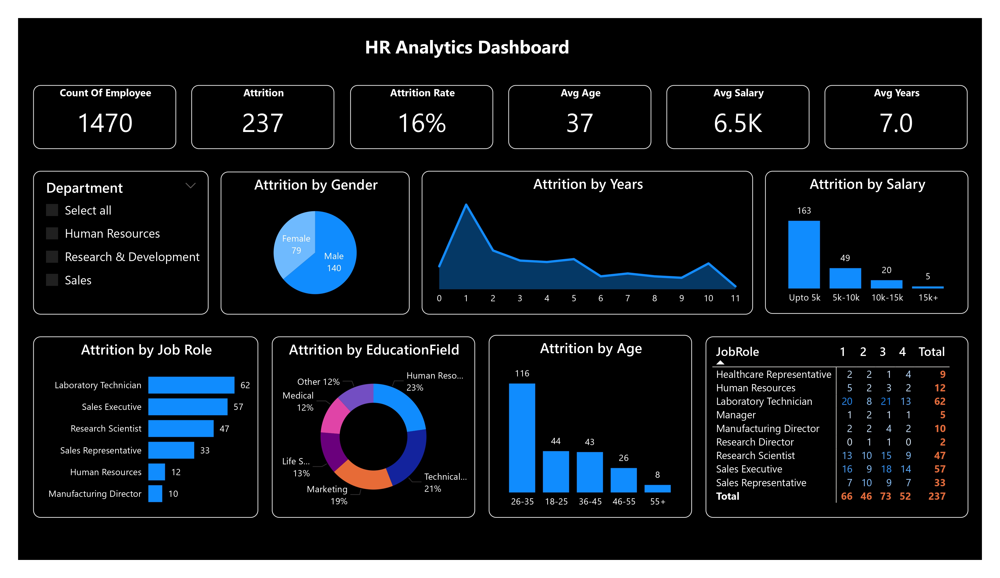

# Power BI HR Analytics Dashboard

HR Analytics dashboard built in Power BI to analyze employee attrition and generate business insights.

## 📌 Project Overview
This project analyzes employee data to uncover attrition patterns, identify key drivers of employee turnover, and provide data-driven recommendations for improving retention.

---

## 🎯 Business Problem
The HR department is facing a high attrition rate and wants to:
- Identify why employees are leaving  
- Detect high-risk employee segments  
- Improve employee retention strategies  

---

## 📊 Dataset Summary
- Total Employees: 1470  
- Attrition Count: 237  
- Attrition Rate: 16%  
- Average Age: 37  
- Average Salary: 6.5K  
- Average Years at Company: 7  

---

## 🧹 Data Cleaning (Power BI - Power Query)
All data cleaning and transformation steps were performed using Power Query in Power BI:

- Removed duplicate records  
- Handled missing values  
- Standardized categorical values (job roles, education fields)  
- Fixed inconsistent and incorrect entries  
- Converted columns to appropriate data types  
- Created calculated columns where required  

---

## 📈 Key Insights

### 🔹 Attrition by Age
- Highest attrition in 26–35 age group  
- Early-career employees are more likely to leave  

### 🔹 Attrition by Salary
- Majority attrition occurs in salary below 5K  

### 🔹 Attrition by Job Role
- Laboratory Technician  
- Sales Executive  
- Research Scientist  

### 🔹 Attrition by Education Field
- Life Sciences  
- Medical  

### 🔹 Attrition by Gender
- Higher attrition among male employees  

---

## 💡 Business Recommendations

### 1. Improve Compensation Strategy
- Increase salary for employees below 5K  
- Introduce performance-based incentives  

### 2. Focus on High-Risk Roles
- Improve job satisfaction in key roles  
- Provide career growth opportunities  

### 3. Retain Early-Career Employees
- Strengthen onboarding programs  
- Provide mentorship and training  

### 4. Employee Engagement
- Conduct feedback surveys  
- Improve work-life balance  

---

## 🛠 Tools Used
- Power BI  
  - Power Query (Data Cleaning & Transformation)  
  - Data Modeling  
  - Dashboard & Visualization  

---

## 📷 Dashboard

---

## 📚 Key Learnings
- Data cleaning is critical for accurate insights  
- Salary and job role strongly impact attrition  
- Dashboards help convert data into business decisions  

---

## 📌 Conclusion
Attrition is mainly driven by salary, job role, and career stage. Targeted strategies can significantly improve employee retention.
